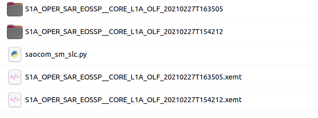
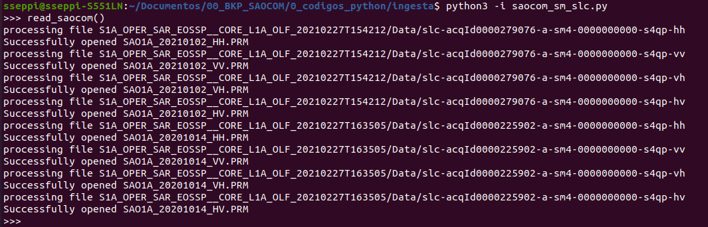
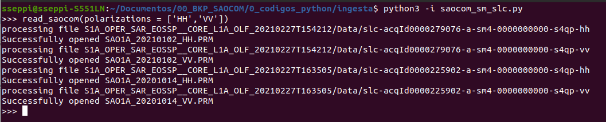
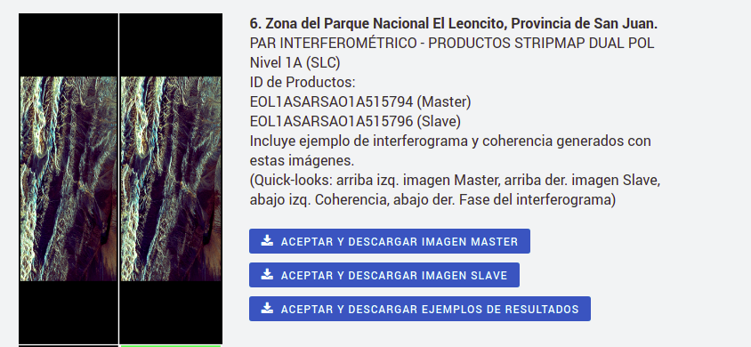

# required packages:
gdal  
os  
rasterio  
xml.etree  
numpy  
datetime  
math  
subprocess  
shutil  
glob  

# sample usage:

This is a first version of the script for testing. In order to try it, the .py file should be place in the same folder of the SAOCOM .xemt files and unzipped data folders:

This script uses a class saocom_sm_slc and a function read_saocom that are used to read SAOCOM-1 Stripmap Data in SLC format to GMTSAR.  To test it, it can be run in interactive mode from the linux terminal.

    >>> python 3 -i saocom_sm_slc.py
    >> read_saocom()
    
This will automatically iterate through all the .xemt files and data folders and will create a directory for each polarization channel with the corresponding PRM,LED and SLC files. It is very important that the original information (with no modifications) is placed within the same folder in order to get this code to work properly.

The script by default reads to GMTSAR all the available polarimetric channels, for all the images. The user can specify the polarization/s to be processed by the optional parameter _polarizations_ in the format of a list. For example ['HH','VV']:

    >>> python 3 -i saocom_sm_slc.py
    >> read_saocom(polarizations = ['HH','VV'])

The script will only run for the selected polarimetric channels:

Sample SAOCOM SLC data can be downloaded from CONAE website: https://catalogos.conae.gov.ar/catalogo/catalogoSatSaocomAdel.html , in particular, the SLC pair suitable for SAR Interferometry is the following:

Link to the master image: https://catalogos.conae.gov.ar/catalogo/redirect.aspx?url=docs/SAOCOM/master.zip  
Link to the slave image: https://catalogos.conae.gov.ar/catalogo/redirect.aspx?url=docs/SAOCOM/slave.zip

