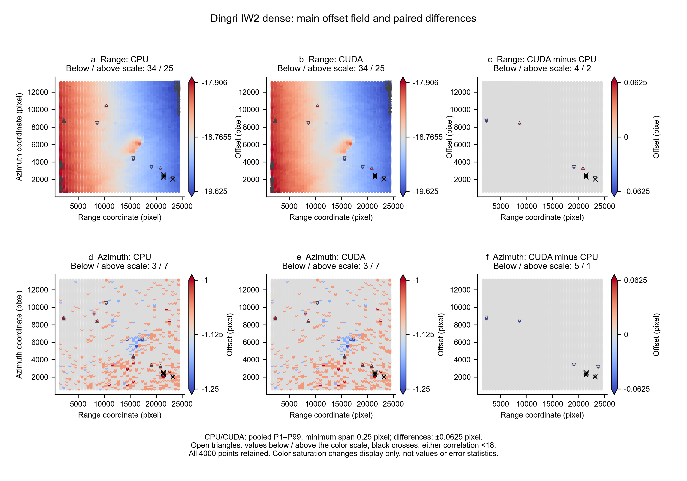
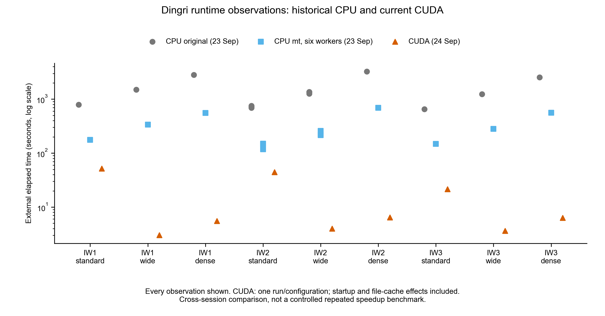

# Validation

## Unified launcher: final local validation, 2026-09-24

Two integration issues were reproduced and fixed: swallowed backend failures
in outer scripts, and stock `-freq` being rejected by the CUDA parser. `xcorr3`
now retains intercepted failures and maps `-freq` to CC's frequency-only mode.

| Check | Result |
|---|---|
| Portable launcher tests | Windows 33/33; Linux 32 passed, 1 Windows-only check skipped |
| Real Linux mode/routing/failure matrix | 73/73 passed, including original/MT/CC, config and real csh |
| Real GMT/GMTSAR synthetic geocoding | 7/7 passed; all four grid arrays match direct CC output |
| CC parameter/PRM sanitizers | 307/307 passed |
| CC host output fault tests | 23/23 passed |
| CC input/output tests through xcorr3 | 12/12 and 6/6 passed |
| Dingri full-grid CC | 9 configurations / 18,000 points unchanged from the accepted pre-entry CUDA baseline |
| Dingri fresh original/MT routing checks | 9 configurations, 2x2 points each; 36 points per backend equal fresh direct-original output |

All three IW subswaths and standard/wide/dense search configurations are covered.
The fresh CPU checks intentionally use small grids; full-grid MT/CPU validation
is historical, with the rebuilt MT executable matching its recorded SHA-256.
No new CUDA/CPU discrepancies were introduced. Concurrent test timings are not
a performance benchmark.

[Test commands](test/README.md) · [Final audit](validation/full/audit.json) ·
[Integration cases](validation/full/integration.json) ·
[Geocoding cases](validation/full/geocode.json) ·
[Dingri comparisons](validation/full/dingri.json) ·
[PowerShell test record](validation/launcher-tests.json)

The tests validate real backend dispatch and synthetic geocoding. They do not
establish full earthquake geocoding or TOPS/ESD interferometric accuracy.

## Prior backend validation

The correlation source code is unchanged apart from whitespace/package layout.
These records predate the unified entry point:

| Backend | Verified results |
|---|---|
| MT | 17/17 Dingri comparisons byte-identical to stock; 55/55 functional cases |
| CC reliability fixes | 23/23 host output/geocoding cases, 6/6 CUDA output cases, 12/12 input cases |
| CC numerical regression | 9 configurations / 18,000 points byte-identical to pre-fix CUDA output |
| CC latest standalone smoke | Fresh build, help, the above 23+6+12 cases, Dingri IW1 standard / 1,000 points byte-identical |

CC/CPU are **not** pointwise equivalent: 17,975/18,000 points had identical
offset pairs; 14 accepted points differed by more than one interpolation step
including rounding tolerance, with a maximum difference of 4.125 pixels.
Original statistics and outliers are retained. Synthetic GMT/GMTSAR geocoding
passed; earthquake geocoding and downstream interferometric accuracy are not
established by these tests.

IW2 (F2), 40 x 100 points, is shown because it covers the epicentral area and
contains a clear localized offset feature. The SAFE geolocation-grid footprints
place the [USGS epicenter](https://earthquake.usgs.gov/earthquakes/eventpage/us6000pi9w/ground-failure)
in IW2, outside IW1/IW3 ([selection record](validation/cc/subswath-selection.json)).
The raw field includes a broad registration gradient; no detrending was applied.

Shared CPU/CUDA scales use pooled P1–P99, with a minimum span of 0.25 pixels;
differences use ±0.0625 pixels. Out-of-scale points remain marked and counted.
All 4,000 points are retained ([source CSV](validation/cc/IW2_dense.csv)).
These are radar-coordinate offsets, not a geocoded deformation map.
[Original/MT on the same IW2 grid](backends/mt/validation/figures/offsets_IW2_dense.png)
are identical. The previous [IW3 comparison](validation/cc/spatial_IW3_dense.png)
is retained as supplementary coverage.

Timing includes historical CPU/MT observations and single CUDA observations;
dates, startup and cache conditions differ. It is not a controlled speedup claim.

[MT full records and figures](backends/mt/VALIDATION.md) ·
[CC original numerical records](validation/cc/results.json) ·
[CC fixed-code regression](validation/cc/real-regression.json) ·
[Standalone smoke](validation/cc/smoke-result.json) ·
[PowerShell launcher test record](validation/launcher-tests.json)
