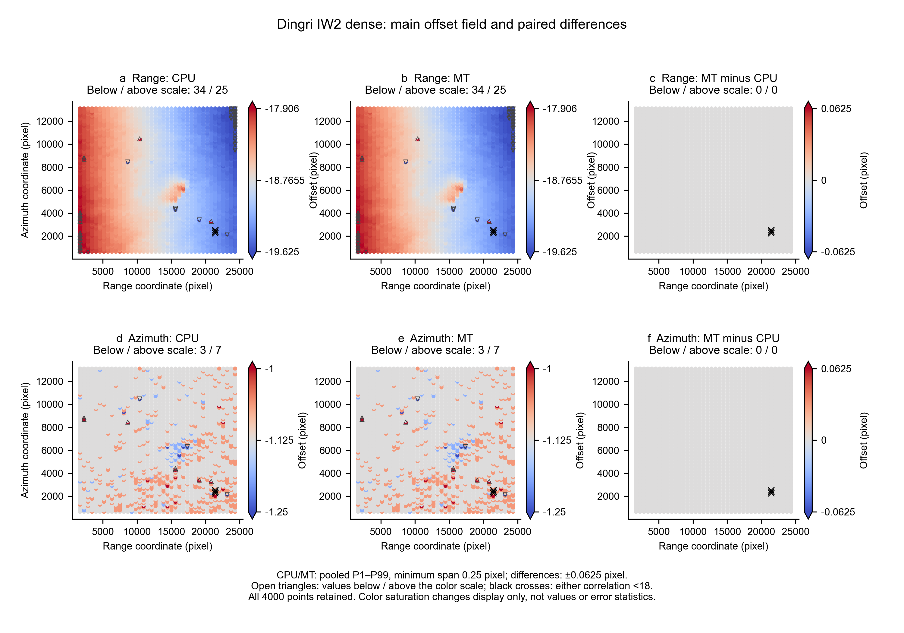
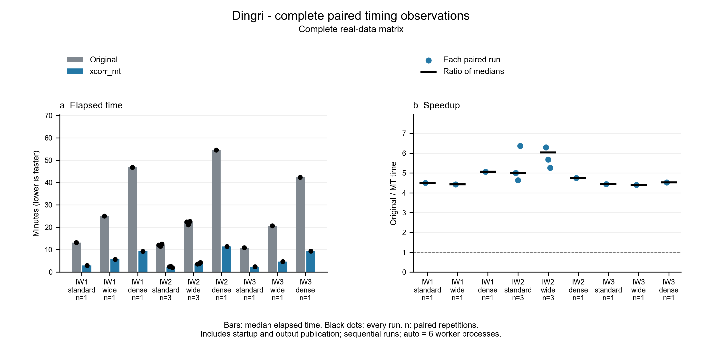

# Dingri validation summary

**Status: computational acceptance passed; submission review pending.**

17/17 comparisons completed; 17 byte-identical; 0 failed. Original Sentinel-1 VV products: 2025-01-05 / 2025-01-17.
Final functional suite: 55/55 passed. Input integrity and independent numerical audit passed.
Historical gmtsar-xcorr launcher: 10 routing checks and 3 real-executable cases passed. These do not validate the new xcorr3 launcher or a full p2p/TOPS workflow.

Ubuntu 24.04 / WSL2, 8 logical CPUs; MT auto selects 6 worker processes.

| Subswath | Configuration | Pairs | Stock seconds | MT seconds | Speedup |
|---|---|---:|---:|---:|---:|
| IW1 | standard | 1 | 789.46 | 175.45 | 4.50x |
| IW1 | wide | 1 | 1499.59 | 338.57 | 4.43x |
| IW1 | dense | 1 | 2807.59 | 554.64 | 5.06x |
| IW2 | standard | 3 | 728.49 | 145.54 | 5.01x |
| IW2 | wide | 3 | 1348.86 | 223.61 | 6.03x |
| IW2 | dense | 1 | 3268.66 | 689.39 | 4.74x |
| IW3 | standard | 1 | 655.46 | 147.76 | 4.44x |
| IW3 | wide | 1 | 1239.07 | 281.63 | 4.40x |
| IW3 | dense | 1 | 2538.06 | 561.41 | 4.52x |

Times are medians of complete pairs. Standard/wide: 20 x 50 points; dense: 40 x 100.
Search parameters: 128/128, except wide 128/256. All repetitions are retained.

IW2 (F2), 40 x 100 points, covering the epicentral area; see the
[subswath selection](../../validation/cc/subswath-selection.json).
Shared original/MT scales use pooled P1–P99 with a minimum span of 0.25 pixels.
Differences use ±0.0625 pixels. Open triangles mark values outside the scale;
black crosses mark corr < 18. All 4,000 points remain visible, without detrending.
Other linked maps retain their historical full-range color scales.

Bars: median elapsed time; black dots: individual runs. Blue dots: paired speedups; black marks: ratio of medians.

These are radar-coordinate correlation offsets, not deformation maps or proof of TOPS/ESD phase accuracy.
Stock `-nointerp` uninitialized fractions are intentionally corrected and tested against a known translation.

[All maps and plotted CSV data](validation/figures/) · [Run records](validation/results.json) ·
[Methods and limitations](VALIDATION_METHODS.md) · [English installation](../../README.md) · [中文安装](../../README.zh-CN.md)
